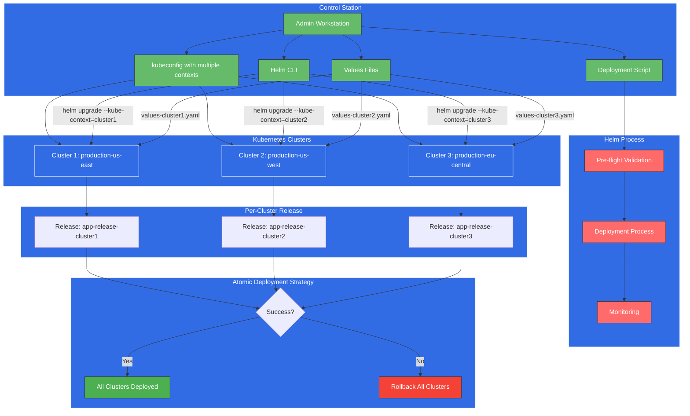

# Multi-Cluster Helm: Managing Deployments Across Kubernetes Environments

In today's distributed edge computing landscape, managing applications across multiple Kubernetes clusters has become a common requirement. Whether for high availability, geographic distribution, or environment separation, multi-cluster deployments introduce complexity that can be challenging to manage.

Helm, the package manager for Kubernetes, offers powerful capabilities to address these challenges. In this post, we'll explore how Helm can support atomic installations across multiple clusters using different Kubernetes contexts.



## The Multi-Cluster Challenge

Before diving into the solution, let's understand the problem:

- **Consistency**: Ensuring applications are deployed with identical configurations across clusters
- **Atomicity**: Guaranteeing that deployments either succeed on all clusters or fail safely
- **Efficiency**: Minimizing manual steps and reducing human error
- **Observability**: Maintaining visibility into deployment status across all environments

## Leveraging Helm for Multi-Cluster Management

Helm provides several features that, when combined with proper scripting and workflow design, enable atomic installations across multiple Kubernetes clusters:

### 1. Kubernetes Contexts

Kubernetes contexts allow you to switch between different clusters from a single control station. Each context represents a cluster, user, and namespace combination stored in your kubeconfig file.

### 2. Helm's Atomic Flag

The `--atomic` flag in Helm ensures that a release is either fully deployed or not deployed at all. If any part of the installation process fails, Helm automatically rolls back the release.

### 3. Release Names and Namespaces

Helm allows specifying release names and target namespaces, which helps organize deployments across multiple clusters.

## Implementation Strategy

Here's a step-by-step approach to implement atomic multi-cluster deployments with Helm:

### 1. Prepare Your Kubeconfig

Ensure your kubeconfig file contains contexts for all target clusters:

```bash
# List available contexts
kubectl config get-contexts

# Switch between contexts
kubectl config use-context cluster1-context
```

### 2. Create a Deployment Script

Design a script that iterates through your clusters and manages the atomicity of the overall deployment:

```bash
#!/bin/bash
set -e

# Define clusters and their contexts
CLUSTERS=("production-us-east" "production-us-west" "production-eu-central")

# Helm chart details
CHART_NAME="my-application"
CHART_VERSION="1.2.3"
RELEASE_NAME="app-release"
NAMESPACE="app-namespace"
VALUES_FILE="values.yaml"

# Pre-flight check on all clusters
for CLUSTER in "${CLUSTERS[@]}"; do
  echo "Validating Helm chart on $CLUSTER..."
  if ! helm template --kube-context="$CLUSTER" \
    --namespace="$NAMESPACE" \
    -f "$VALUES_FILE" \
    "$CHART_NAME" > /dev/null; then
    echo "Chart validation failed on $CLUSTER"
    exit 1
  fi
done

# Deploy to all clusters
for CLUSTER in "${CLUSTERS[@]}"; do
  echo "Deploying to $CLUSTER..."
  helm upgrade --install \
    --kube-context="$CLUSTER" \
    --namespace="$NAMESPACE" \
    --create-namespace \
    --atomic \
    --timeout 10m \
    -f "$VALUES_FILE" \
    "$RELEASE_NAME-$CLUSTER" \
    "$CHART_NAME"
done

echo "Deployment completed successfully on all clusters!"
```

### 3. Add Cluster-Specific Values

For cluster-specific configurations, use values files with overrides:

```yaml
# values-common.yaml (shared settings)
replicaCount: 3
image:
  repository: myapp
  tag: 1.0.0

# values-us-east.yaml (cluster-specific overrides)
ingress:
  host: us-east.example.com
storage:
  storageClass: aws-ebs-us-east
```

Then modify the script to include cluster-specific values:

```bash
helm upgrade --install \
  --kube-context="$CLUSTER" \
  --namespace="$NAMESPACE" \
  --atomic \
  -f values-common.yaml \
  -f "values-$CLUSTER.yaml" \
  "$RELEASE_NAME-$CLUSTER" \
  "$CHART_NAME"
```

## Advanced Techniques

### Parallel Deployments

For faster deployments, consider running the installations in parallel:

```bash
# Inside your script
for CLUSTER in "${CLUSTERS[@]}"; do
  deploy_to_cluster "$CLUSTER" &
done

# Wait for all deployments to complete
wait
```

### Rollback Strategy

In case of failure, implement a coordinated rollback:

```bash
# Track success/failure
FAILED_CLUSTERS=()

for CLUSTER in "${CLUSTERS[@]}"; do
  if ! deploy_to_cluster "$CLUSTER"; then
    FAILED_CLUSTERS+=("$CLUSTER")
  fi
done

# If any deployment failed, roll back successful ones
if [ ${#FAILED_CLUSTERS[@]} -gt 0 ]; then
  echo "Deployment failed on clusters: ${FAILED_CLUSTERS[*]}"
  echo "Rolling back successful deployments..."
  
  for CLUSTER in "${CLUSTERS[@]}"; do
    if [[ ! " ${FAILED_CLUSTERS[*]} " =~ $CLUSTER ]]; then
      helm rollback --kube-context="$CLUSTER" "$RELEASE_NAME-$CLUSTER" 0
    fi
  done
  
  exit 1
fi
```

## Conclusion

Helm's contextual awareness combined with scripting enables powerful multi-cluster deployment capabilities. By following the strategies outlined above, you can achieve consistent, atomic installations across your Kubernetes infrastructure, reducing operational overhead and improving reliability.

Remember that while this approach handles the deployment mechanics, you should also consider the broader multi-cluster management aspects, including service discovery, network policies, and data synchronization between clusters.

In the modern Kubernetes landscape, mastering multi-cluster deployments is becoming an essential skill for platform teams looking to build resilient, globally distributed applications.
