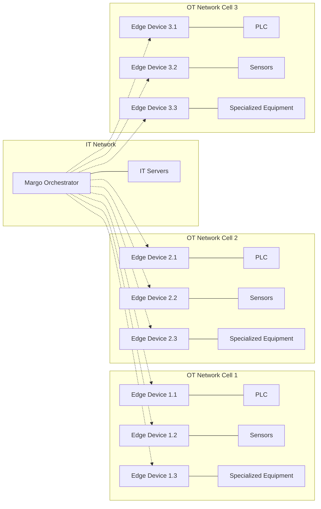
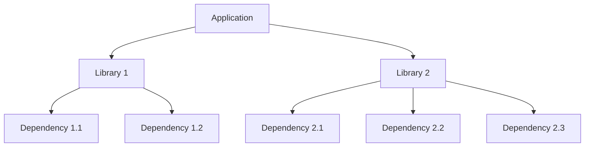
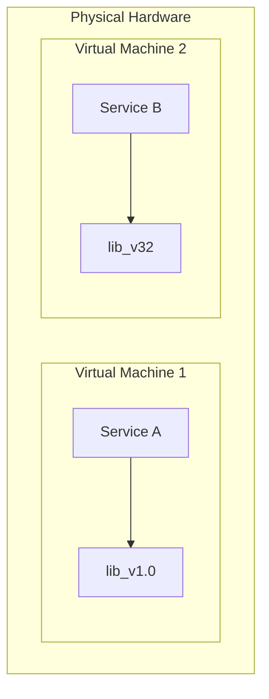
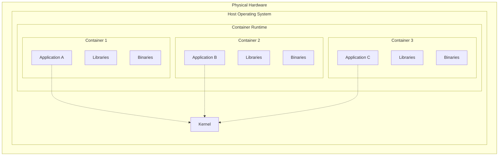
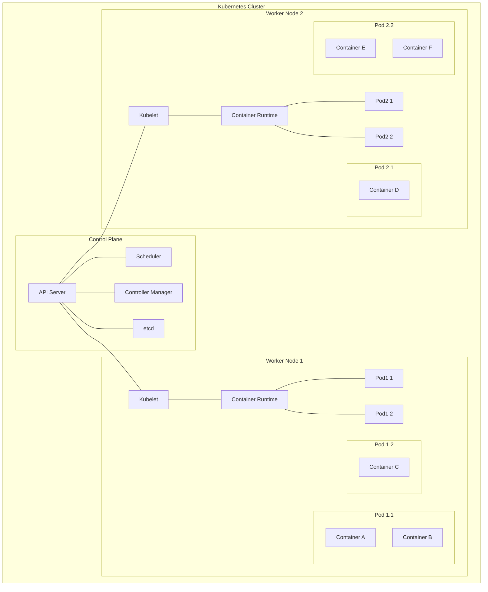

# The Evolution of Application Deployment: From Binaries to Orchestration

# The goal of this article is to structure discussion around Kubernetes vs. Docker, which drastically depends on typical industry use-cases.

## Introduction

This article examines deployment technologies through the lens of a specific industrial use case: a manufacturing facility operating 9 edge devices across 3 OT network cells. This moderate-scale deployment—chosen to balance redundancy, load balancing, and process complexity needs — may represents a common scenario in modern industrial automation. We're explicitly not addressing single device deployments, where simpler solutions may be entirely appropriate.

As we'll demonstrate, complexity in software deployment doesn't disappear—it simply shifts and transforms, requiring increasingly sophisticated tools to manage effectively. However, this complexity must be justified by measurable benefits in reliability, maintainability, and operational efficiency. My analysis aims to illustrate when technologies like Kubernetes provide value and when simpler alternatives might offer better return on investment.

## Reference Network Topology
Our reference deployment consists of an IT network hosting the Margo Orchestrator connected to three separate OT network cells. Each cell contains three edge devices collecting data from various industrial equipment including PLCs, sensors, and specialized machinery.



This architecture requires coordinated deployment of applications across multiple devices, often with different hardware specifications and varying connectivity quality. The edge devices must function reliably even when temporarily disconnected from the central orchestrator.

## The Unix Philosophy: Simple Beginnings

In computing's early days, the Unix philosophy championed simplicity: developers wrote code that compiled to binary and executed directly on machines. This straightforward approach—write, compile, execute—worked effectively for isolated programs with minimal dependencies.


In our reference deployment, this approach would require manually installing and configuring software on each of the nine edge devices individually—manageable for static, rarely changing software, but quickly becoming unwieldy for frequently updated applications.

**Cost-Benefit Assessment**: For static applications with few dependencies deployed to a small number of devices, direct binary installation remains the simplest and most efficient approach. The cost of implementing more complex deployment systems outweighs the benefits.

## Package Managers: Managing Growing Complexity

As software evolved, applications began requiring multiple libraries and supporting components. Compiling from source for each installation became impractical and inefficient. This challenge spawned package formats like DEB (Debian) and RPM (Red Hat Package Manager) that handled installation, configuration, and dependencies in one cohesive system.

However, this solution introduced a new problem: dependency graphs. When a DEB package required five libraries, each requiring three additional dependencies, users faced a complex directed acyclic graph (DAG) nearly impossible to resolve manually.



For our reference deployment, package managers would enable standardized installation across the nine edge devices, but would still require individual management of each device, potentially leading to configuration drift over time.

**Cost-Benefit Assessment**: For deployments with 5-10 devices running applications with moderate dependency complexity, package managers offer significant benefits over manual binary installation. The investment in learning and implementing package-based deployment pays off through reduced installation errors and simplified updates.

## The Virtualization Revolution

Despite these advancements, "dependency hell" persisted—applications often required conflicting versions of the same libraries. Virtualization offered a breakthrough solution by enabling multiple virtual machines on shared hardware.

This technology provided complete isolation: Service A could run with dependency lib_v1.0 while Service B used lib_v32, each in its own virtual environment. This isolation dramatically reduced compatibility issues and enabled more predictable, reliable deployments.



In our reference topology, virtualization would allow each edge device to run multiple isolated application environments, but with considerable resource overhead—a significant concern for devices with limited computing capacity.

**Cost-Benefit Assessment**: Virtualization becomes justified when application isolation requirements outweigh resource efficiency concerns. For our nine-device scenario with resource-constrained edge hardware, full virtualization's benefits rarely justify its overhead costs, making it appropriate only for specific use cases requiring extreme isolation.

## The Container Revolution

While virtual machines solved numerous problems, they introduced significant resource overhead—each VM required a complete operating system. Linux containers emerged as a lightweight alternative, sharing the host's kernel while maintaining application isolation.


This approach substantially reduced overhead and accelerated both development and distribution cycles. Containers enabled independent scaling of application components (database, business logic, frontend), but this independence introduced the challenges of distributed systems, famously articulated as the "eight fallacies":

1. The network is reliable
2. Latency is zero
3. Bandwidth is infinite
4. The network is secure
5. Topology doesn't change
6. There is one administrator
7. Transport cost is zero
8. The network is homogeneous

For our reference deployment, containers provide an excellent balance of isolation and efficiency, allowing the nine edge devices to run multiple applications without excessive resource consumption. However, managing containers across multiple devices introduces coordination challenges.

**Cost-Benefit Assessment**: For multi-application deployments on resource-constrained devices, containers provide compelling benefits over both package-based installation and full virtualization. The investment in containerization capabilities pays dividends through improved resource utilization and application isolation.

## From Docker to Kubernetes

Google's experience running massive systems on commodity hardware—where failures were inevitable—fostered a philosophy of resilient distributed computing. Rather than attempting to prevent failures (impossible at scale), they designed systems that treated hardware failures as normal events, allowing software to continue functioning regardless.

Docker revolutionized container management by addressing the complexity of "raw" Linux containers, offering an improved developer experience for building, testing, and deploying containerized applications. However, when organizations scaled to multiple teams producing hundreds of containers running mission-critical applications, Docker's single-machine focus became a limitation.

This constraint catalyzed the creation of Kubernetes—a comprehensive orchestration platform designed specifically for the operational challenges of running distributed applications at scale. Kubernetes directly addressed the distributed systems fallacies that Docker alone couldn't solve.



In our reference deployment, Docker alone would require managing each of the nine edge devices separately, while Kubernetes could provide a unified control plane for coordinating deployments, ensuring availability, and managing failures automatically.

**Cost-Benefit Assessment**: The investment in Kubernetes becomes justified when:
- The number of containers exceeds what can be easily managed manually (~20-30)
- High availability requirements demand automated failover
- Multiple teams need to deploy applications to the same infrastructure
- Standardized deployment patterns across environments are required

For our nine-device scenario, a lightweight Kubernetes implementation could be appropriate if these conditions are met, but simpler container orchestration tools might offer better ROI for less demanding requirements.

## The Standardization of Container Infrastructure

The containerd specification emerged to standardize container runtime interfaces. This API—used by both Docker and Kubernetes—decoupled container runtimes from orchestration platforms, similar to how package formats (DEB/RPM) were separated from configuration management tools like Chef or Puppet.

As system requirements grew more complex—networking between containers, consistent environments across development/staging/production, and deploying complex systems to customer sites—Helm emerged as a crucial "templating" engine. This tool enabled consistent workload deployment across multiple clusters while maintaining configuration integrity.

Following CI/CD best practices and leveraging the mature Kubernetes API, GitOps tools like ArgoCD evolved to manage Kubernetes at massive scale—thousands of clusters—with deployments typically orchestrated through Git-based workflows.

For our reference deployment, these standardization efforts allow choosing the right level of orchestration complexity without vendor lock-in, ensuring future flexibility as requirements evolve.

**Cost-Benefit Assessment**: Investing in standardized interfaces and practices becomes valuable when:
- Deployment requirements are likely to change over time
- Multiple vendors or tools need to integrate with the deployment pipeline
- The organization needs to preserve optionality for future technology choices

The cost of learning and implementing these standards is justified by the flexibility and future-proofing they provide, even for moderate-scale deployments like our reference scenario.

## Recommendations for Margo: Preserving Unix Simplicity in Modern Deployments

As Margo develops its approach to edge computing deployments, it should recognize how CLI patterns have maintained consistent paradigms despite technological evolution. Throughout decades of infrastructure management, familiar command patterns have persisted:

```
svn update, make install       # Source control and compilation
scp file.deb, dpkg -i file.deb # Manual transfer and package installation
apt update, apt install        # Repository-based package management
git pull, docker build         # Container image creation
helm repo update, helm install # Kubernetes application deployment
```

These patterns share a common sequence: first, retrieve the latest information (update), then apply changes (install). This fundamental flow aligns with the Unix philosophy of simplicity and composability, where tools do one thing well and can be chained together. Margo should preserve this intuitive pattern in its edge deployment strategy.

### Deployment Model Complexity vs. Scale Inflection Points

For our nine-device reference deployment, the following inflection points can guide technology choices:

| Deployment Technology | Appropriate Scale | When to Consider | When to Avoid |
|--------------------------|------------------|-----------------|---------------|
| Manual Binary Installation | 1-3 devices | Static applications with few dependencies | Frequently updated applications |
| Package Managers | 3-10 devices | Moderate dependency complexity | Applications requiring isolation from each other |
| Containers (Docker) | 5-20 devices | Multiple applications per device | Complex coordination across devices |
| Light Orchestration (K3s) | 10-50 devices | High availability requirements | Resource-constrained devices where overhead is prohibitive |
| Full Orchestration (K8s) | 50+ devices | Multiple teams deploying applications | Simple deployments where complexity isn't justified |

For our reference deployment of nine devices, a container-based approach with lightweight orchestration capabilities would likely provide the optimal balance of functionality and operational simplicity.


## Conclusion

The evolution of application deployment technologies represents a continuous effort to manage increasing complexity. Each advancement has addressed specific limitations of its predecessors, shifting complexity rather than eliminating it. However, this doesn't mean the most complex solution is always appropriate.

For deployments like our nine-device reference topology, the ideal approach lies in selecting deployment technologies that provide sufficient capabilities to address real operational challenges without introducing unnecessary complexity. The cost-benefit equation must consider not just the technical capabilities, but also the operational overhead, learning curve, and long-term maintainability of the chosen solution.

By acknowledging both the lessons of deployment history and the practical realities of operational environments, Margo can create an edge orchestration approach that delivers the right level of capability for different deployment scenarios—applying sophisticated tools where justified and embracing simplicity where appropriate.
